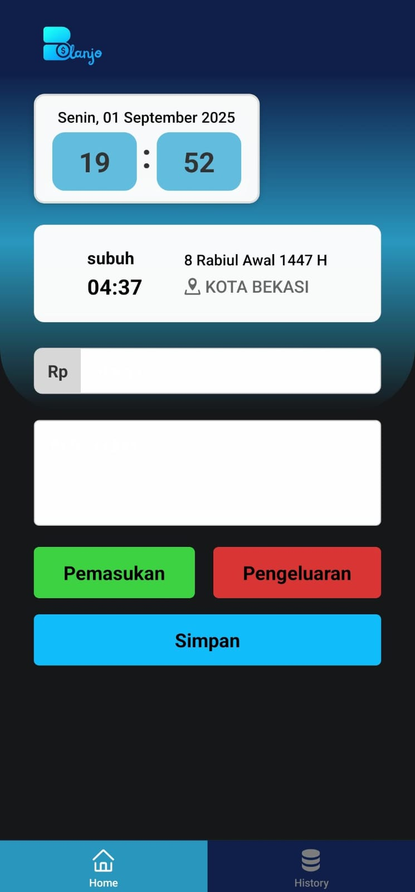

# Balanjo | Money Management Apps 


  
  
  
  
  
  

📱 An application designed to record daily financial transactions, equipped with **daily prayer times** and **real-time clock** using React Native + Expo.

---

## 🚀 Main Utama  

- 💰 **save financial transactions**
- ⏰ **Real-time day and clock** 
- 🕌 **Next prayer time**   
- 🎨 UI simple & responsive  

---

## 📦 Tech Stack  

- [React Native](https://reactnative.dev/)  
- [Expo](https://expo.dev/)  
- [TypeScript](https://www.typescriptlang.org/)  
- [Date API](https://developer.mozilla.org/en-US/docs/Web/JavaScript/Reference/Global_Objects/Date)  

---

## 🛠️ Installation  

1. Clone repo  
   ```bash
   git clone https://github.com/username/prayer-times-app.git
   cd prayer-times-app
   ```

2. Install dependencies 
   ```bash
   $ npm install
   # atau
   $ yarn install
   ```

3. Running Project
   ```bash
   npx expo start 
   npx expo build -p --profile preview
   ```
4. Scan the QR Code using the Expo Go app on your phone

## 📸 Preview




## 🫱🏾‍🫲🏿 Support and Contact

For any issues or queries, feel free to reach out to us on [My social media](https://www.linkedin.com/in/alfitra-fadjri/).

# Thank You